---
## Front matter
lang: ru-RU
title: Лабораторная работа №3
subtitle: Настройка прав доступа
author:
  - Перфилов Александр Константинович | Группа НПИбд-03-24
institute:
  - Российский университет дружбы народов, Москва, Россия
date: 20 сентября 2025

## i18n babel
babel-lang: russian
babel-otherlangs: english

## Formatting pdf
toc: false
toc-title: Содержание
slide_level: 2
aspectratio: 169
section-titles: true
theme: JuanLesPins
colortheme: beaver
fonttheme: professionalfonts
innertheme: rounded
outertheme: infolines

## Fonts
mainfont: Liberation Serif
romanfont: Liberation Serif
sansfont: Liberation Sans
monofont: Liberation Mono
mainfontoptions: Ligatures=TeX
romanfontoptions: Ligatures=TeX
sansfontoptions: Ligatures=TeX,Scale=MatchLowercase
monofontoptions: Scale=MatchLowercase,Scale=0.9
---

# Информация

## Докладчик

:::::::::::::: {.columns align=center}
::: {.column width="70%"}

  * Перфилов Александр Константинович
  * Группа НПИбд-03-24
  * Российский университет дружбы народов
  * <https://github.com/AlexanderPErfilovKonstantinivich?tab=repositories>

:::
::: {.column width="30%"}

:::
::::::::::::::

# Вводная часть

## Объект и предмет исследования

- Настройка прав доступа для групп пользователей в Linux

## Цель работы

- Получение навыков настройки базовых и специальных прав доступа для групп пользователей в операционной системе типа Linux.

# Ход лаборатороной работы

## Создание и просмотр файлов

- Создадим каталоги /data/main и /data/third под учетной записью root. Просмотрим информацию о владельце

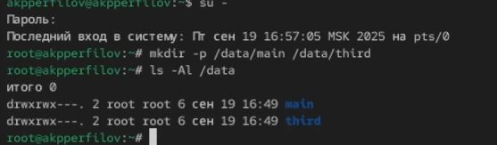{#fig:001 width=71%}

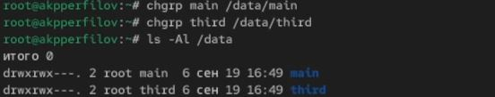{#fig:001 width=71%}

## Измнение владельцев каталогов 

- Изменим владельцев этих каталогов с root на main и third. Просмотрим информацию о владельце

{#fig:001 width=70%} 

## Измнение прав доступа к файлам

- Установим права на запись для владельцев каталогов, запретив доступ остальным. Проверим установленные права доступа

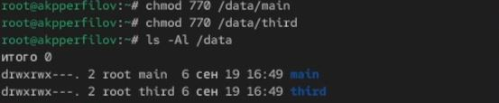{#fig:001 width=70%}

## Создание файла под другой учетной запиьсю для проверки изменений

- Перейдем под учётную запись пользователя bob
- Попробуем перейти в каталог /data/main и создать файл emptyfile в этом каталоге

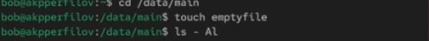{#fig:001 width=70%}

## Создание каталогов и файлов под учетной записью alice

- Откроем новый терминал под пользователем alice. Перейдем в каталог /data/main и создадим два файла

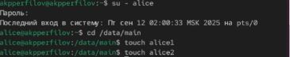{#fig:001 width=70%}

## Просмотр каталога и удаление файлов под учётную запись bob 

- В другом терминале перейдем под учётную запись bob. Просмотрим инфомарцию о каталоге /data/main
- Попробуем удалить файлы, принадлежащие пользователю alice

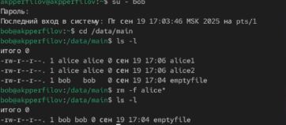{#fig:001 width=65%}

## Создание файлов под учётной записью bob

- Создадим два файла

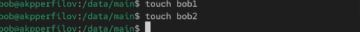{#fig:001 width=65%}

## Измение параметров

- В терминале под пользователем root установим для каталога /data/main бит идентификатора группы, а также stiky-бит для общего каталога группы

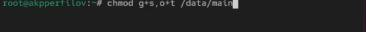{#fig:001 width=80%}

## Создание файлов под учетной записью alice и просмотр информации всех файлов

- Под пользователем alice создадим в каталоге /data/main файлы

- Теперь мы должны увидеть, что два созданных нами файла принадлежат группе main, которая является группой-владельцем каталога /data/main

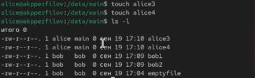{#fig:001 width=50%}

## Попытка удаление файлов bob'а

- Под пользователем alice попробуем удалить файлы, принадлежащие пользователю bob

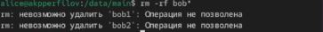{#fig:001 width=65%}

- Как мы видим sticky-bit предотвратил удаление этих файлов пользователем alice, поскольку этот пользователь не является владельцем этих файлов. 

## Управление расширенными разрешениями с использованием списков ACL

- Для изменений прав доступа группам и пользователям нужно будет использовать пакет acl и команды setfacl (для установки прав) и getfacl (для просмотра установленных прав).
- Кратко опишем синтаксис команды setfacl.
- Установить разрешения для пользователя: **setfacl -m "u:user:permissions" \<file/dir\>**
- Установить разрешения для группы: **setfacl -m "g:group:permissions" \<file/dir\>**
- Наследование записи ACL родительского каталога: **setfacl -dm "entry" \<dir\>**
- Удаление записи ACL: **setfacl -x "entry" \<file/dir\>**
- Синтаксис команды getfacl: **getfacl \<file/dir\>**

## Изменение прав для каталогов

- Откроем терминал с учётной записью root
- Установим права на чтение и выполнение в каталоге /data/main для группы third и права на чтение и выполнение для группы main в каталоге /data/third:
`
{#fig:001 width=70%}

## Просмотр информации о разрешений для каталогов

- Используем команду getfacl, чтобы убедиться в правильности установки разрешений:

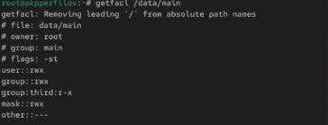{#fig:001 width=45%} 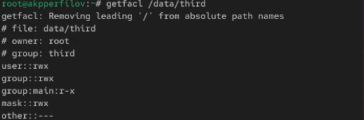{#fig:001 width=45%}

## Создание файла и просмотр информации в каталоге main

- Создадим новый файл с именем newfile1 в каталоге /data/main
- Проверим текущие назначения полномочий

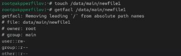{#fig:001 width=80%}

## Установка ACL по умолчанию

- Установим ACL по умолчанию для каталога /data/main
- Добавим ACL по умолчанию для каталога /data/third

{#fig:001 width=80%}

## Проверка ACL в main

- Убедимся, что настройки ACL работают, создадим новый файл в каталог /data/main
- Проверим текущие назначения полномочий

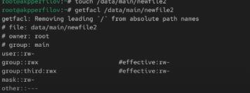{#fig:001 width=65%}

## Проверка полномочий группы third, удаление файлов

- Для проверки полномочий группы third в каталоге /data/third войдем в другом терминале под учётной записью члена группы third
- Проверим операции с файлами

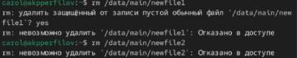{#fig:001 width=70%}

- Удалить файлы мы не смогли, так как newfile1 принадлежит пользователю root и группе main, newfile2 также принадлежит root, main и third, хоть и carol находится в последней группе, у группы недостаточно прав.

## Проверка полномочий группы third, запись файлов

- Проверим, возможно ли осуществить запись в файл

{#fig:001 width=70%}

- Мы не смогли осуществить запись в newfile1, так как прав у группы third на нее нет. А вот уже в newfile2 все получилось, так как права на изменение файла у данной группы есть.

## Вывод:

В ходе работы приобретены умения по управлению базовыми и специальными правами доступа для групп пользователей в ОС Linux.
